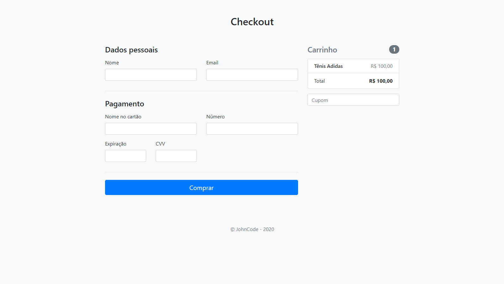
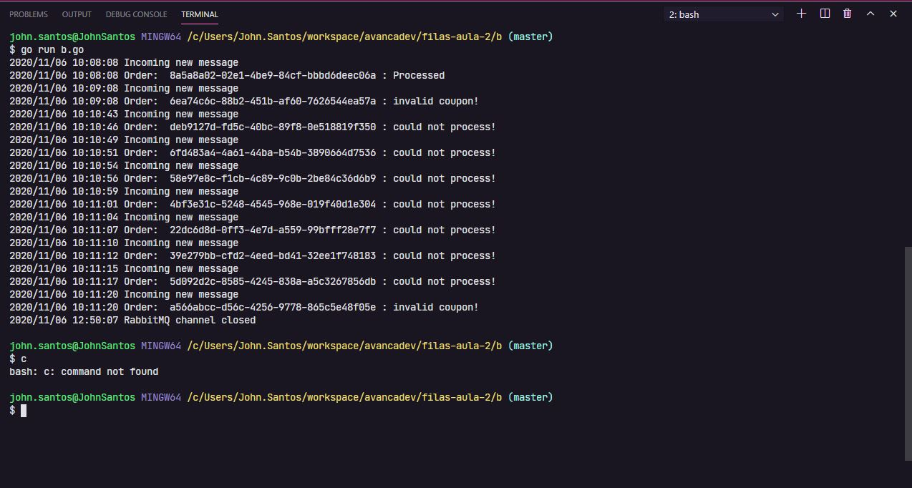

<h1 align="center">
    
</h1>

  <a href="#-tecnologias">Tecnologias</a>&nbsp;&nbsp;&nbsp;|&nbsp;&nbsp;&nbsp;
  <a href="#-projeto">Projeto</a>&nbsp;&nbsp;&nbsp;|&nbsp;&nbsp;&nbsp;
  <a href="#memo-licença">Licença</a>

 

 

## 🚀 Tecnologias

Esse projeto foi desenvolvido com a seguinte tecnologia:

- [GO Lang](https://golang.org/)
- [Rabbitmq](https://www.rabbitmq.com/)
- [Docker](https://www.docker.com/)

## 💻 Projeto

Esse projeto foi desenvolvido durante a AvançaDev da **[fullcycle](https://fullcycle.com.br)**, que consiste em criar 4 microsserviços de um fluxo de checkout de uma compra.

Nessa etapa foi implementado RabbitMQ para gerenciamento da fila de pedidos

<h1 align="center">
    
</h1>

## :memo: Licença

Esse projeto está sob a licença MIT. Veja o arquivo [LICENSE](LICENSE.md) para mais detalhes.

Este projeto foi desenvolvido com ❤️ por **[@John Everton](https://www.linkedin.com/in/john-everton01/)**, com o instrutor **[@wesleywillians](https://github.com/wesleywillians)**.  
Se isso te ajudou, dê uma ⭐, isso vai me ajudar também! 😉

